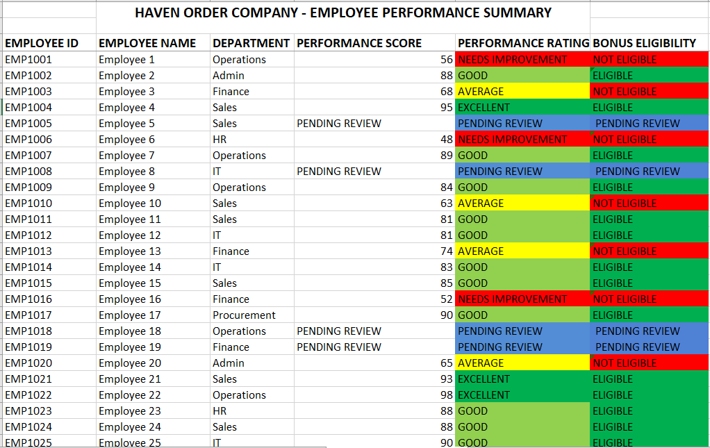

# Haven Order Company – Employee Performance Summary (Excel)

## Project Overview
Haven Order Company's HR team maintains employee information and performance records in separate worksheets. This project builds a Performance Summary that automatically pulls data from both sources and calculates each employee's performance rating and bonus eligibility — no manual cross-referencing required.

## Business Problem
- Employee details and performance scores are stored in separate worksheets, making it hard to get a full picture of each employee at a glance.
- Manually assigning ratings and bonus eligibility is time-consuming and prone to human error.
- Some employees don't yet have a performance record, and this needs to be clearly flagged rather than left blank or shown as an error.

## Solution
An Excel workbook with three sheets:
- **Employee Information** – Employee ID, Name, Department, Hire Date
- **Performance Records** – Employee ID, Performance Score
- **Performance Summary** – automatically generated, combining both sources with calculated ratings and eligibility

## Features
| Feature | Purpose |
|---|---|
| XLOOKUP / VLOOKUP | Retrieves Employee Name, Department, and Performance Score from separate worksheets |
| IFERROR | Displays "Pending Review" when no performance record exists for an employee |
| Nested IF | Assigns a Performance Rating (Excellent, Good, Average, Needs Improvement) based on score |
| IF + OR | Determines Bonus Eligibility based on the assigned rating |
| Conditional Formatting | Color-codes ratings and eligibility for quick visual scanning (green = positive, red = negative, yellow = average, blue = pending) |

## How It Works
1. Employee ID is used to look up the employee's Name, Department, and Performance Score from the two source worksheets.
2. If no performance score exists, the row displays "Pending Review" across Rating and Eligibility instead of an error.
3. Where a score exists, it's automatically converted into a Performance Rating using set score bands.
4. Bonus Eligibility is then determined based on that rating.

## Rating & Eligibility Logic
| Performance Score | Rating | Bonus Eligibility |
|---|---|---|
| 90–100 | Excellent | Eligible |
| 75–89 | Good | Eligible |
| 60–74 | Average | Not Eligible |
| Below 60 | Needs Improvement | Not Eligible |
| No record | Pending Review | Pending Review |

## Files Included
- `Performance_Summary.xlsx` — full workbook with all three worksheets
- `screenshot.png` — visual of the completed Performance Summary sheet

## Screenshot

## Skills Demonstrated
- Cross-sheet lookups (XLOOKUP / VLOOKUP)
- Error handling (IFERROR)
- Nested conditional logic (IF, OR)
- Conditional formatting for data visualization
- Structuring a multi-sheet Excel workbook for HR reporting

## How to Use This Workbook
1. Download `Performance_Summary.xlsx`
2. Update the Employee Information and Performance Records sheets with your own data
3. The Performance Summary sheet will automatically recalculate ratings and eligibility for all employees
